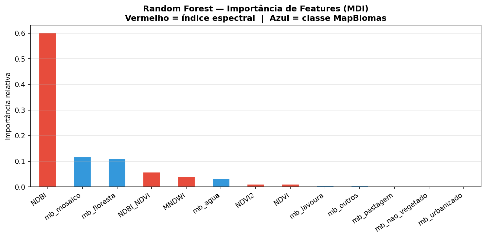
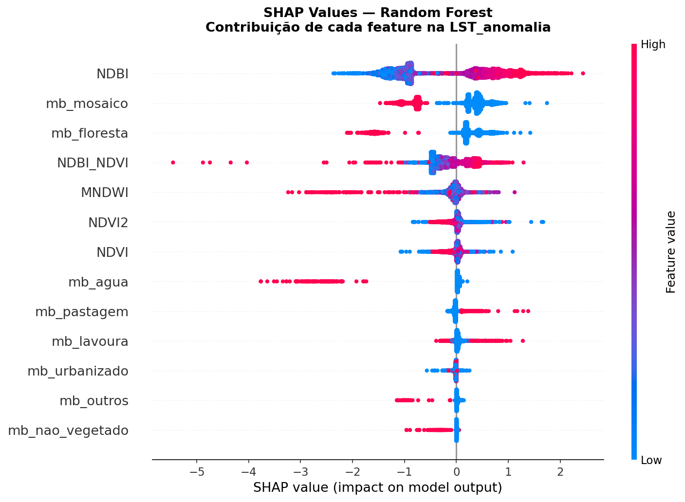
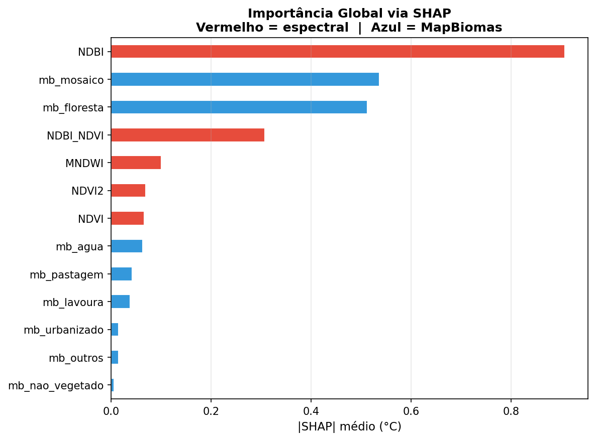
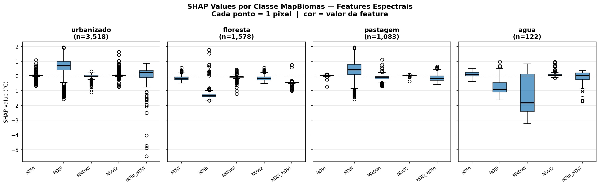
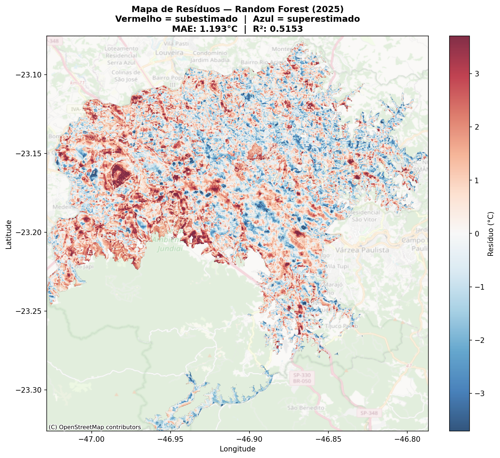

# Urban Heat Island in Jundiaí/SP

Analysis of the Surface Urban Heat Island (SUHI) in Jundiaí/SP using remote sensing, spectral indices, MapBiomas land cover and Machine Learning models with SHAP-based explainability.

## Data

- Landsat LST (Land Surface Temperature) for 2017, 2019, 2021, 2023 and 2025.
- Spectral indices: NDVI, NDBI, MNDWI, NDVI², NDBI/NDVI.
- MapBiomas land cover classes: urban, mosaic, forest, pasture, cropland, water, non-vegetated, others.
- Target: `LST_anomalia` (LST relative to the scene mean).

## Structure

| File | Description |
|------|-------------|
| `jundiai_bloco_g_modelos.py` | Block G — model training (RF + XGBoost), SHAP and residual map. |
| `features_master.parquet`    | Consolidated DataFrame (pixel × year) with features and target. |
| `Jundiai_SUHI_2025.tif`      | Reference LST raster for 2025. |
| `Jundiai_Residuos_2025.tif`  | Output — spatial residuals of the RF model for 2025 (generated by Block G). |
| `fig_G1_rf_importancia.png`  | Random Forest feature importance (MDI). |
| `fig_G2_shap_beeswarm.png`   | SHAP beeswarm — all features. |
| `fig_G3_shap_bar.png`        | Mean |SHAP| per feature. |
| `fig_G4_shap_por_classe.png` | SHAP values per MapBiomas class. |
| `fig_G5_mapa_residuos.png`   | Spatial residual map (2025). |

## Methodology (Block G)

1. Temporal split: training with 2017–2023, testing with 2025 (no temporal leakage).
2. Random Forest (`n_estimators=300`, `max_depth=15`, `min_samples_leaf=50`).
3. XGBoost (`n_estimators=400`, `max_depth=8`, `lr=0.05`, `tree_method='hist'`).
4. Evaluation: R² (train/test) and MAE.
5. SHAP TreeExplainer on a 10k-pixel sample from the test set.
6. Georeferenced residual map on the 2025 LST grid.

## Results

### Feature Importance — Random Forest (MDI)

Feature ranking by the Mean Decrease Impurity criterion. Red bars represent spectral indices and blue bars represent MapBiomas classes. Indicates which variables the model most relies on to reduce impurity at splits, providing a first global view of each feature's relevance.

### SHAP Beeswarm — Per-Pixel Contribution

Each dot is a pixel; its X-axis position shows the feature's impact on the `LST_anomalia` prediction and the color encodes the feature value (blue = low, red = high). Allows reading the direction, magnitude and dispersion of each variable's effect at once.

### Mean |SHAP| per Feature

Global importance in physical units (°C): mean absolute SHAP value per feature. Complements MDI by avoiding the Random Forest bias toward high-cardinality features.

### SHAP per MapBiomas Class

Distribution of SHAP values of the spectral features segmented by land cover class (urban, forest, pasture, water). Shows the non-linearity of the problem — the same NDVI or NDBI can contribute in opposite directions depending on the land cover context.

### Residual Map — Random Forest (2025)

Spatial difference between observed and RF-predicted `LST_anomalia` for 2025. Red indicates underestimation (a warming factor not captured by the features); blue indicates overestimation. Areas with high residuals point to where the model needs additional features or where local dynamics deviate from the trained pattern.

## Acknowledgments

Special thanks to [@thimvaz](https://github.com/thimvaz), who did most of the work on this project.

